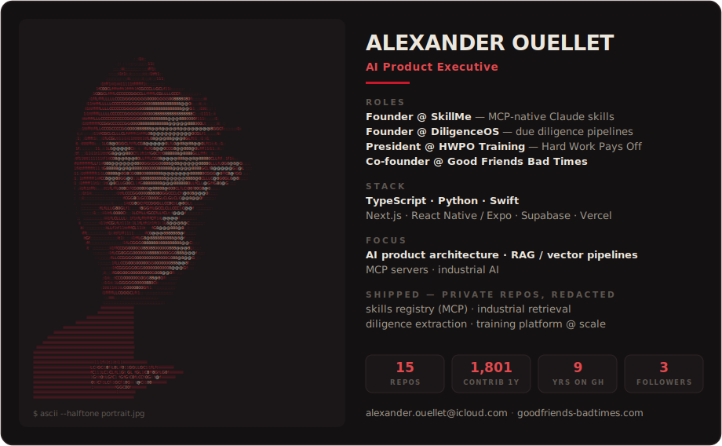

<!--
  aouellets · profile readme
  design tokens (GFBT, Technical/Dense): surfaces #141112/#1b1718 (light #faf8f4/#f0ece3)
  · bone #ece7dd · blood red #c9182b / #e5484d — defined in scripts/build_profile.py.
  The hero card is generated by scripts/build_profile.py (ASCII face portrait +
  live stats, dark/light variants) and refreshed daily by the profile workflow.
  Banner/typing/snake/badge colors are query params on the image URLs below.
-->

<picture>
  <source media="(prefers-color-scheme: dark)" srcset="https://capsule-render.vercel.app/api?type=waving&height=110&color=0:0a0a0a,100:7a0f1a&section=header" />
  
</picture>

<!-- The dark card is served on BOTH GitHub themes on purpose — a dark hero
     panel on the light page is the GFBT look. Swap the src to
     assets/profile-light.svg here if you ever want a theme-matched variant;
     the generator still builds both. -->

<samp><b>$ ls ~/ventures</b></samp>

 

| Venture | Role | Focus |
|:--|:--|:--|
| **SkillMe** | Founder | The skills marketplace for Claude — agents browse, install, and version their own capabilities over MCP |
| **[Good Friends Bad Times](https://www.goodfriends-badtimes.com/)** | Co-founder | The name is the promise — a brand for the people who show up when it counts |
| **HWPO Training** | President | Hard Work Pays Off — Mat Fraser's training company, shipping champion-grade programming as a daily product |
| **DiligenceOS** | Founder | Due diligence as a pipeline — documents in, structured decisions out |

<h3 align="center"><samp>$ which stack</samp></h3>

  

<h3 align="center"><samp>$ tail -f contributions.log</samp></h3>

  <picture>
    <source media="(prefers-color-scheme: dark)" srcset="https://raw.githubusercontent.com/aouellets/aouellets/output/github-snake-dark.svg" />
    <source media="(prefers-color-scheme: light)" srcset="https://raw.githubusercontent.com/aouellets/aouellets/output/github-snake.svg" />
    
  </picture>

<h3 align="center"><samp>$ cat contact</samp></h3>

&nbsp;

<picture>
  <source media="(prefers-color-scheme: dark)" srcset="https://capsule-render.vercel.app/api?type=waving&height=110&color=0:7a0f1a,100:0a0a0a&section=footer" />
  
</picture>

